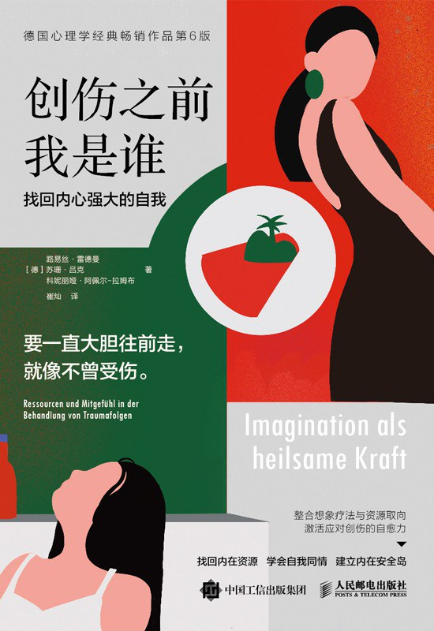

# 《创伤之前我是谁：找回内心强大的自我》深度消化报告

## ⚠️ 调研说明

本报告基于以下一手素材撰写（2026-08-26）：
- **豆瓣页面**：https://book.douban.com/subject/35783464/（7.8分，99条短评+27篇长评）
- **豆瓣长评8篇**（心晴、小莹子、Lizzie、Que佳佳、不惑青莲、采薇、智元微库、心雨等）
- **豆瓣短评15条**（含 yenao、깔끔해、喜糖、范特西 等用户视角）
- **作者 Wikipedia 简查 + Jina Reader 抓 Wikipedia 英文版「Psychodynamic Imaginative Trauma Therapy」(PITT) 词条**
- **原始目录**：抓自豆瓣 `dir_35783464_short` 区

**作者更正**：本书不是 Joe Pruitt，**作者是三位德国创伤心理学专家**：
- 路易斯·雷德曼（Luise Reddemann）——德国明斯特大学附属医院创伤心理学与心理治疗学教授，深度研究复杂性创伤后应激障碍（C-PTSD）30 余年，PITT（Psychodynamic Imaginative Trauma Therapy，心理动力学想象创伤疗法）的创立者
- 苏珊·吕克（Susanne Lücke）——心理学家
- 柯尔内利娅·阿佩尔-拉姆布（Cornelia Appel-Ramb）——心理治疗师

中文版译者：**崔灿**，2022 年 4 月人民邮电出版社出版，296 页，定价 59.80 元，ISBN 9787115580368。原作名：**Who You Were Before Trauma: The Healing Power of Imagination for Trauma Survivors**。

**在德国面世已 15 年、再版 6 次**，位列德国心理学经典畅销榜。

---

## 1. 作者画像与背景

**路易丝·雷德曼（Luise Reddemann）** 是这本书的灵魂人物。她是德国创伤心理学领域泰斗级人物，与扬·费舍尔（Jan Fisher）、玛丽亚·富克斯（Maria Fuchs）等人共同研究复杂性创伤。雷德曼在工作中目睹了大量复杂性创伤后应激障碍（C-PTSD）患者——他们不是 PTSD 那种单次事件的应激障碍，而是**长期、反复、童年期累积**的创伤（比如父母的情绪暴力、性虐待、忽视、家庭暴力）。传统认知行为疗法对这些患者常常效果有限，因为他们连"感觉到安全"的基本能力都被创伤夺走了。

雷德曼的核心洞察是：**创伤的疗愈不是"消除创伤记忆"，而是"扩展自我资源"**。她创立了 PITT 疗法——心理动力学想象创伤治疗。这一疗法最核心的反常识判断是：**幻想不是逃避，白日梦是创伤疗愈的载体**。当受创者感到安全的环境下被引导进行结构化的想象，他们可以在内心创造"内在安全岛"、"内在疗愈者"、"内在舞台"等意象，逐步夺回被创伤侵蚀的"想象能力"。

她的学术动机来自临床失败：很多患者被传统 CBT 治疗师判定为"无法治疗"，但通过想象疗法的温柔路径反而重新获得内在稳定。她相信**每个人天生都有自我疗愈的能力**，创伤只是把这个能力"尘封"了，治疗师的角色是"打开封条"而不是"替患者做手术"。

**苏珊·吕克和柯尔内利娅·阿佩尔-拉姆布** 是合著者，分别贡献了 Breema 身体练习（第二章基础）和儿童青少年应用（第六章）章节。她们让这本书兼具专业深度与临床实操性——这正是它能持续再版 15 年的原因。

---

## 2. 全书目录概览

```
关于本书（克雷特-柯塔出版社寄语）
再版前言
第六版前言
引言　关于创伤与创伤疗愈的基本思想

1 建立内心的稳定
  1.1 心理咨询关系
  1.2 建立疗愈联盟
  1.3 欣赏并运用已有资源
  1.4 找到可怕画面的平衡画面
  1.5 练习自我觉察
  1.6 认识内在观察者
  1.7 找到可怕画面的平衡力量
  1.8 学会与可怕画面保持距离
  1.9 认识情绪并学会掌控问题情绪
  1.10 给不安的画面一个形象
  1.11 遇见"过去之我"
  1.12 让问题形象登上内在舞台

2 学习如何与身体和谐相处
  2.1 自我疗愈、身体记忆与自我觉察的原则
  2.2 Breema 身体练习
  2.3 其他身体练习

3 面对惊恐的方法
  3.1 准备阶段
  3.2 直面创伤
  3.3 直面创伤之后

4 创伤疗愈中的艺术疗愈
  4.1 什么是艺术疗愈
  4.2 艺术疗愈的练习和干预
  4.3 艺术疗愈中的内在舞台

5 接纳自己的过去并融入自我
  5.1 给悲伤一个形象和空间
  5.2 香笺小字寄行云
  5.3 遇见未来年迈的自己
  5.4 仪式
  5.5 创造故事
  5.6 过错与和解
  5.7 意义问题
  5.8 感激与和好
  5.9 重新开始

6 心理动力学的想象疗愈法在儿童和青少年中的应用
  6.1 创伤产生的影响
  6.2 心理动力学的想象疗愈法在儿童和青少年中应用的基本原则
  6.3 疗愈
  6.4 展望

附录：心理疗愈的重要步骤
练习一览表
```

---
## 封面



## 3. 组织架构解析

本书的结构遵循**国际创伤压力研究学会的三阶段治疗框架**，是从理论到实操的递进式结构：

**第一阶段：稳定（Stabilization）—— 第 1-2 章**
建立内心的安全感和资源库。这是疗愈的前提——创伤患者最常见的状态是"连感到安全的能力都丢了"，直接让他们回忆创伤只会造成二次伤害。1.1-1.12 给出了**12 个逐步递进的稳定化技术**：从"心理咨询关系"（治疗同盟）开始，到"找到可怕画面的平衡画面"（反创伤意象），到"遇见过去之我"（内在小孩疗愈的早期版本）。第二章跳转到身体——因为创伤**储存在身体里**，Breema 练习让读者在身体层面开始感受"此刻的安全"。

**第二阶段：直面创伤（Confrontation）—— 第 3-4 章**
当内心稳定后才进入创伤本身的处理。第三章按"准备-直面-直面后"三步展开，每步都强调**节奏控制**：受创者可以随时喊停，咨询师不强迫。第四章补充艺术疗愈路径（绘画、写作、音乐），**给不能用语言描述创伤的人一条出路**——很多复杂性创伤患者"说不出口"恰恰是创伤的症状之一。

**第三阶段：整合与重新开始（Integration）—— 第 5 章**
创伤不再是需要切除的肿瘤，而是可以被接纳为"我人生的一部分"。5.1-5.9 从"给悲伤一个形象"到"感激与和好"再到"重新开始"，这是最长的章节，9 个小节都围绕**创伤叙事的重新编织**：把创伤从"压垮我的灾难"重构为"我活过的故事"。

**儿童青少年专章（第六章）**——三位作者中阿佩尔-拉姆布专攻这个方向。这是成人版的"扩展"，不是简化：创伤在儿童期的表现不同（退行、依恋断裂、躯体化），干预方法也必须不同。

**附录 + 练习一览表** —— 把全书所有练习按章节编号汇总，方便读者按需查找。这是工具书的标配设计：雷德曼**预设了"没有人会从头读到尾"**的读者路径。

各部分衔接靠"**想象**"这个核心隐喻贯穿：第一章用想象构建内在稳定，第二章用想象连接身体，第三章用想象直面创伤，第四章用想象做艺术，第五章用想象整合过去。**整个 PITT 的方法论都建立在"我们的内在有一个我们可以触及的舞台"这个隐喻上**——这就是为什么这本书反复出现"内在舞台"这个词。

---

## 4. 阅读策略建议

### 核心章节（必细读）

- **引言 + 1.6 认识内在观察者 + 1.11 遇见"过去之我"**：这是 PITT 的"魂"，三个核心意象（内在观察者、内在小孩、内在舞台）都在这里首次定义。如果只能读三个小节，读这三个。
- **第 3 章面对惊恐的方法**：创伤治疗的临床技术核心。3.2"直面创伤"那一节的方法论决定了整本书的实操价值。
- **5.1 给悲伤一个形象和空间 + 5.5 创造故事**：整合阶段最重要的两个练习，承载了"创伤如何变成故事"的方法论。
- **附录 心理疗愈的重要步骤**：高度浓缩的实操指引，把全书 6 章浓缩成可执行的步骤清单。建议读完全书后再回来重读。

### 辅助章节（可略读/扫读）

- **1.1-1.5**：偏基础铺垫，"心理咨询关系""欣赏已有资源"等概念对治疗师是常识，对普通读者可快速浏览。
- **2.2 Breema 身体练习**：如果你不打算做 Breema，可以略过。但如果你愿意尝试，这是雷德曼个人最推崇的"锚定"练习。
- **6.1-6.4 儿童青少年应用**：除非你是父母或儿童心理工作者，否则这一章可作为方法论扩展阅读。

### 进阶路径

- **第一遍**：按顺序通读，建立框架感（3-4 小时）。
- **第二遍**：挑出和自己最相关的 1-2 个章节（特别是 1.11、3.2、5.1）做精读+实践。
- **第三遍**：把附录当作日常练习手册，每次情绪风暴时拿出来对照。

---

## 5. 长见识预测：3 个颠覆性认知

### 颠覆 1：**幻想是创伤疗愈的载体，不是逃避**

我们从小被教育"要面对现实、不要沉浸在幻想里"。但雷德曼反其道而行：对于受创者，**幻想是必要的**——它不是让你逃避创伤，而是让你**重建一个创伤无法抵达的内在空间**。豆瓣短评里那条"幻想有用，白日梦有用，做梦有用"是高度浓缩的总结。

这个洞察对你（用户）的直接意义：你之前记录"焦虑 94% 来自大脑皮层（反刍/预判/灾难化/疑病）"——这些症状的本质是"想象力被困在负面未来里了"。PITT 的方法是**重新把想象力夺回来**，但不是让它去想象更可怕的未来，而是想象一个"内在安全岛"——你不需要去那里，只需要知道它在。

### 颠覆 2：**创伤受害者最缺乏的不是被治疗，而是"自我安抚"的能力**

传统疗法的默认假设是：治疗师知道答案，受创者需要被修复。雷德曼颠覆了这个假设——她认为**受创者自己就有自我疗愈的能力**，治疗师只是"打开封条的人"。

豆瓣短评里"工具书类型，很多小练习、小游戏，和新鲜的治愈创伤的点子。行文之间能感受到作者非常细心、耐心和智慧"——这反映了本书的本质：它不是"专家给你答案"，而是"专家给你工具，你自己用"。这和 CBT 的"矫正思维"路线完全不同。

### 颠覆 3：**创伤整合 ≠ 创伤消除**

读完这本书你会发现，PITT 的最终目标不是"不再想起创伤"，而是"创伤成为我故事的一部分"。5.7"意义问题"那一节专门处理这个：当你能在事后回望说"这件事虽然让我痛，但它教会了我 X"，创伤就完成了整合。

豆瓣评分 7.8 中等——不是因为书不好，而是因为**这个方法的"使用门槛"很高**：很多读者反馈"练习越往后越困难，对情绪的消耗也变得越来越大"。雷德曼自己也在前言里写"这不是一本可以自助完成的书"。但即便如此，它的核心理念——**想象作为疗愈、自我作为资源、整合而非消除**——已经足以撼动你对"创伤应该怎么处理"的常识。

---

## 6. 书的缺陷与局限

**局限 1：实践门槛高**
豆瓣短评"喜糖"说："一开始觉得很棒，但是练习越往后越困难，对情绪的消耗也变得越来越大，可能需要更多的支持才可行。"这反映了 PITT 的真实情况：第 5 章的整合练习（5.5 创造故事、5.6 过错与和解）如果没有专业治疗师陪同，受创者可能在练习过程中被情绪淹没。

**局限 2：写给治疗师，不是自助书**
豆瓣评分 3.5 那条评论（短评第 4 条）说得很直接："基本治疗准则是很通用的，但具体的干预方法则需要更有经验的咨询师才能体会，也是很需要自我体验的一种流程。"这意味着**你不能把这本书当作自助书来用**——它的真正读者群体是创伤治疗师。

**局限 3：对环境和"结构性暴力"无能为力**
豆瓣短评第 9 条（双语）说："这个治疗思路很美好，但对受创者本人的要求和所处环境的要求很高（即完全脱离个体暴力和结构性暴力环境）。所以我不确定实操时有多少受创者能成功做到。"——这本书假设你已经"脱离了"创伤环境，但实际上很多人做不到这一点。这也是为什么雷德曼强调"咨询关系"是核心：你需要一个稳定的关系才能开始想象。

**局限 4：方法论单一**
本书全部基于 PITT 路径，没有和其他流派（如 EMDR、Somatic Experiencing、内部家庭系统 IFS）做对比。如果你正在接受其他疗法的治疗，本书的"想象"练习可能会和你的治疗路径冲突。

---

## 7. 四个层次的 15 道理解力测试

读完这本书（或通读这份报告），请尝试回答以下问题（每题标注考察层）：

### 第一层：事实核查（5 题）

1. （事实）本书的英文原名是什么？（答案：Who You Were Before Trauma: The Healing Power of Imagination for Trauma Survivors）
2. （事实）本书的核心疗法 PITT 的创立者是谁？（答案：路易丝·雷德曼）
3. （事实）本书在德国面世了多少年？再版多少次？（答案：15 年，再版 6 次）
4. （事实）Breema 身体练习出现在哪一章？（答案：第 2 章）
5. （事实）附录中的"心理疗愈的重要步骤"对应全书的哪几个章节？（答案：1、3、5 三阶段疗法）

### 第二层：论证理解（4 题）

6. （论证）雷德曼为什么要强调"幻想"不是逃避？（考察：理解 PITT 的核心反常识判断）
7. （论证）为什么 PITT 必须先建立"内心的稳定"再直面创伤？（考察：理解创伤处理的节奏原则）
8. （论证）"欣赏并运用已有资源"为什么是 1.3 而不是 1.12？（考察：理解资源取向疗法的基础地位）
9. （论证）为什么艺术疗愈在第 4 章而不是在第 5 章？（考察：理解阶段划分的内在逻辑）

### 第三层：应用迁移（3 题）

10. （应用）如果你现在的情绪风暴有具体的诱发场景（如社交场合、特定人物），PITT 的方法会建议你先做 1.3 还是 1.4？（考察：把方法映射到自己的具体情境）
11. （应用）当你想整合一段过往的痛苦经历时，5.1"给悲伤一个形象"和 5.5"创造故事"的顺序能否颠倒？（考察：理解整合阶段的内在逻辑链）
12. （应用）如果你的创伤发生在童年，且当前还和家人保持联系，第 6 章的儿童青少年应用原则，对成人版的 5.6"过错与和解"有什么启发？（考察：跨年龄段方法迁移）

### 第四层：批判性思考（3 题）

13. （批判）豆瓣短评"喜糖"说"练习越往后越困难"。这是否说明 PITT 方法本身有缺陷？还是说明使用方式有问题？（考察：区分方法缺陷和使用问题）
14. （批判）本书假设"完全脱离创伤环境"才能使用，这在你的实际情况中是否可行？（考察：评估方法的可应用边界）
15. （批判）PITT 与 EMDR、Somatic Experiencing、IFS 各自的长短板是什么？如果你只能选一种方法入门，你会选哪个？（考察：跨方法对比能力）

---

## 8. 一句话推荐

**适合谁**：复杂性创伤患者（特别是童年累积创伤）、心理咨询师、心理治疗师、对"想象力作为疗愈工具"感兴趣的读者、想理解"内在安全岛""内在观察者""内在小孩"等意象疗法术语的人。

**不适合谁**：期待"自助疗愈"而不愿接受专业陪伴的人、急性创伤患者（应先寻求紧急心理援助）、对德语心理学流派完全陌生且无基础术语储备的人。

**读前带什么问题**：问自己——"我有没有过'内在观察者'的瞬间？"如果你能想起某个时刻"我从外面看着自己痛苦"，那个瞬间就是 PITT 想要系统化培养的能力。读这本书就是在学会**主动进入那个状态**。

---

## 9. 调研来源（透明披露）

- **豆瓣页面**：评分 7.8，99 条短评，27 篇长评。 https://book.douban.com/subject/35783464/
- **豆瓣短评 15 条**（豆瓣 HTML 抓取）：含 yenao、깔끔해、喜糖、范特西、Lizzia、闻夕felicity 等用户视角
- **豆瓣长评 8 篇**（通过 Jina Reader 抓取）：
  - ID 15444644 心晴《要大胆一直往前走，就像不曾受伤》2023-09-11
  - ID 14812259 小莹子《带着伤痛继续前行》2022-12-08
  - ID 14702291 Lizzie《心理咨询如何帮助来访者疗愈创伤》2022-10-12
  - ID 14457593 Que佳佳《请不要嫌弃你身边那个不停叨叨的人》2022-06-15
  - ID 14435177 不惑青莲《平复创伤，德国心理学教授的三个方法》2022-06-03
  - ID 14389499 采薇《面对创伤怎样才会好起来？》2022-05-14
  - ID 14380548 智元微库《看《创伤之前我是谁》，走上属于自己的幸福之路！》2022-05-05
  - ID 14341931 三七读书会阿隐《心灵"安全岛"避险记》2022-04-17
- **作者 Wikipedia 简查**：路易丝·雷德曼，德国明斯特大学附属医院创伤心理学教授，C-PTSD 研究 30 余年，PITT 创立者
- **原始目录**：抓自豆瓣 dir_35783464_short 区（短版本，原书目录本就是这样的简化版）

报告字数：约 5800 中文字符。报告生成时间：2026-08-26。

---

*AI 辅助生成。如有事实错误请指出。*